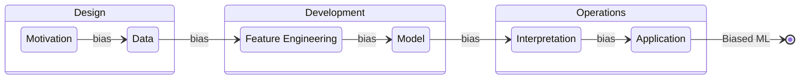

# BIAS in Machine Learning

Machine learning bias, also called algorithmic or AI bias, is the tendency of a model to exhibit a preference or prejudice for certain outcomes or groups over others.

Bias is extremely complex and can occur at many points in Machine Learning

## How bias occurs in each stage of MLOPS

### Design

**Business Problem**: When the business problem is inherantly bias.

**Refactoring to ML Problem**: When ML problem is refactored and bias is introduced, reinforced or amplified.

**Data**: When raw data is improperly selected, incomplete or untrue in any form.

### Development

**Data Wrangling**: When data is cleaned and transformed prior to being ingested into a model for training, such as missing values or rounding errors and bias is introduced, reinforced or amplified.

**Feature Engineering**: When features are selected or engineered with bias or that amplify inherant bias.

**Model Selection**: Bias can be amplified in the selection of the actual models or algorithms such as classification versus regression; some algorithms are more sensitive to bias than others.

**Model Fit and Refinement**: When models are coded, if needed, and undergo training and testing, errors in algorithms can impact bias.

**Model Evaluation** When there is insufficient or biased validation. Such as the when the training data is insufficient, absent or the training testing split aplifies or creates bias.

### Operations

**Operations**: Improper human feedback or monitoring can drive errors in the model, reducing its effectiveness or allowing the model to degrade overtime.

**Interpretation**: User will apply their own interpretations and opinions about the predicted output. Users who don't trust or "like" the predicted output will insert their own errors and biases, reducing the model's value.

## Types of Bias

**Algorithm bias**: This occurs when there's a problem within the algorithm that performs the calculations or other processing that powers the ML computations.

**Automation bias**: This occurs when the results of automated systems are preferred over the results of human or other non-automated systems, even though the automated system might not provide better accuracy. In other words, users trust AI more.

**Sample bias**: This happens when there's a problem with the data used to train the ML model. In this type of bias, the data used either isn't large enough or representative enough to teach the system. For example, using training data that features only female teachers trains the system to conclude that all teachers are female.

**Prejudice bias**: In this case, the data used to train the system reflects existing prejudices, stereotypes and faulty societal assumptions, thereby introducing those same real-world biases into the machine learning itself. For example, using data about medical professionals that includes only female nurses and male doctors could perpetuate a real-world gender stereotype about healthcare workers in the computer system.

**Implicit bias**: Similar to prejudice bias, implicit bias occurs when models are designed or data is curated using the human designer's own ways of thinking or personal experiences, which might not fully or accurately map to the task at hand.
Group attribution bias. This occurs when the characteristics of an individual or single sample are improperly applied to a broader set of individuals or a group of data points. Such generalizations made about an entire group can overlook the nuances of individual samples.

**Measurement bias**: As the name suggests, this bias arises due to underlying problems with the accuracy of the data and how it was measured or assessed. Using pictures of happy workers to train a system meant to assess a workplace environment could be biased if the workers in the pictures knew they were being measured for happiness; a system being trained to precisely assess weight is biased if the weights contained in the training data were consistently rounded up or down.

**Exclusion or reporting bias**: This happens when an important data point is left out of the data being used. This can happen if the modelers don't recognize the data point as consequential. For example, incidents reported in police crime analytics might be skewed when incidents go unreported or under-reported because victims fail to report the incidents.

**Selection bias**: This occurs when the data used in training either isn't large enough or representative enough, thereby misrepresenting and lowering accuracy results and performance. There are several variations of selection bias, including coverage bias where the data isn't representative, participation bias where non-responses leave gaps in data, and sampling bias where statistical randomization isn't used.

**Recall bias**: This data quality bias develops in the data labeling stage, where labels are inconsistently given through subjective observations. Recall is measured as how many points are labeled accurately over the total number of observations in a model.

**Gender Bias**: LLMs can give bias in the output when the model associates specific traits, roles, or behaviors predominantly with a particular gender. For example, associating roles like “nurse” with women or providing gender stereotypical sentences such as “she is a homemaker” in response to ambiguous prompts.

**Socioeconomic Bias**: Socioeconomic bias happens when the model associates certain behaviors or values with a specific economic class or profession. For example, the model output provides that “successful” is primarily only about white-collar occupations.

**Ability Bias**: Bias occurs when the model outputs stereotypes or negative associations regarding individuals with disabilities. If the model produces this result, offensive language shows bias.
